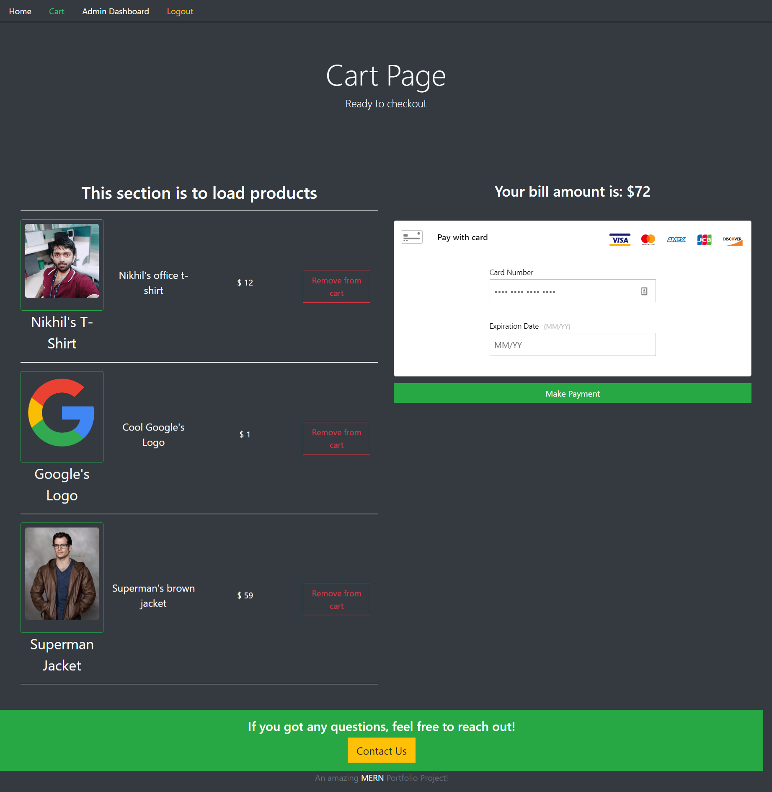
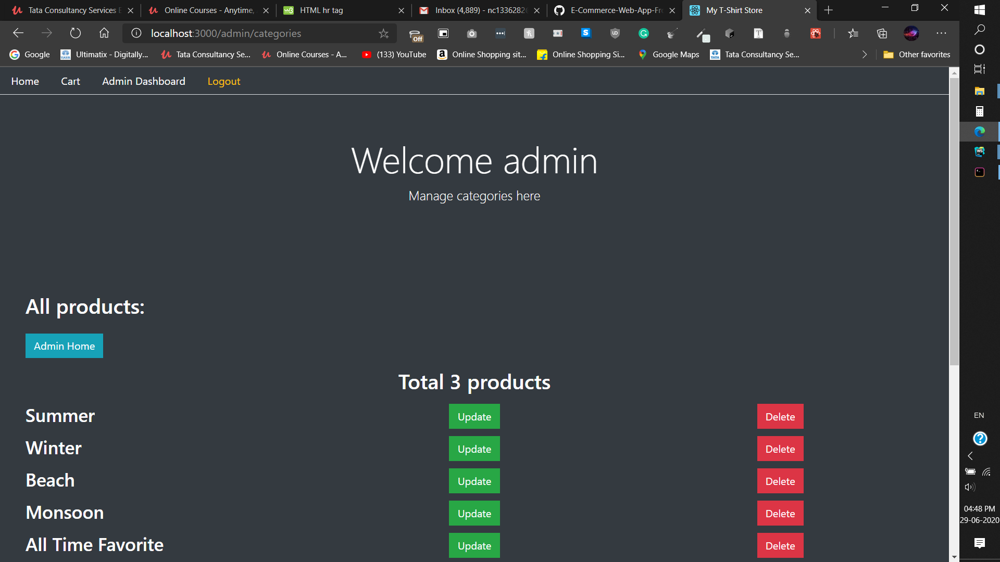
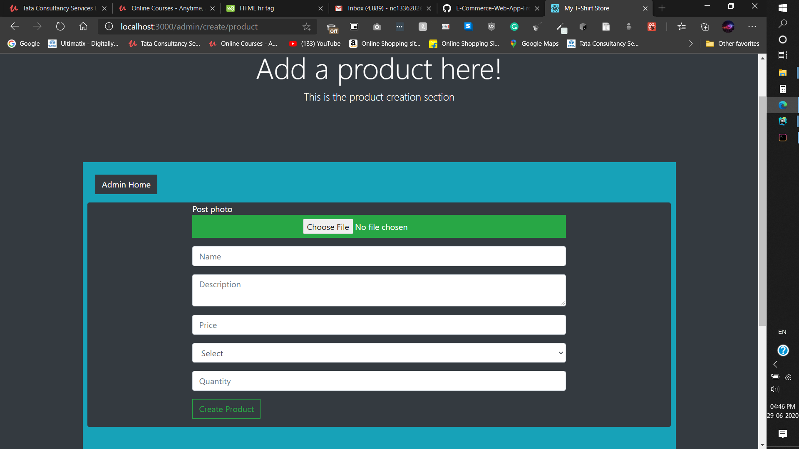
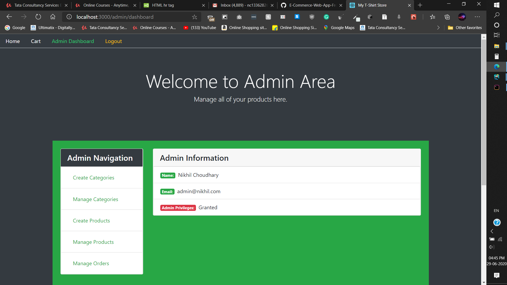

# Shoppersonic (Frontend)
#### This is an E-Commerce based web app which is kind of an Amazon clone. You will have to clone the "Shoppersonic (Backend)" as well to run this.

## Usage instructions
#### Run the E-Commerce-Web-App-Backend first (Usage instructions available that repo)
### Run the following commands (Once E-Commerce-Web-App-Backend is up and running):-
#### npm install
#### npm start

