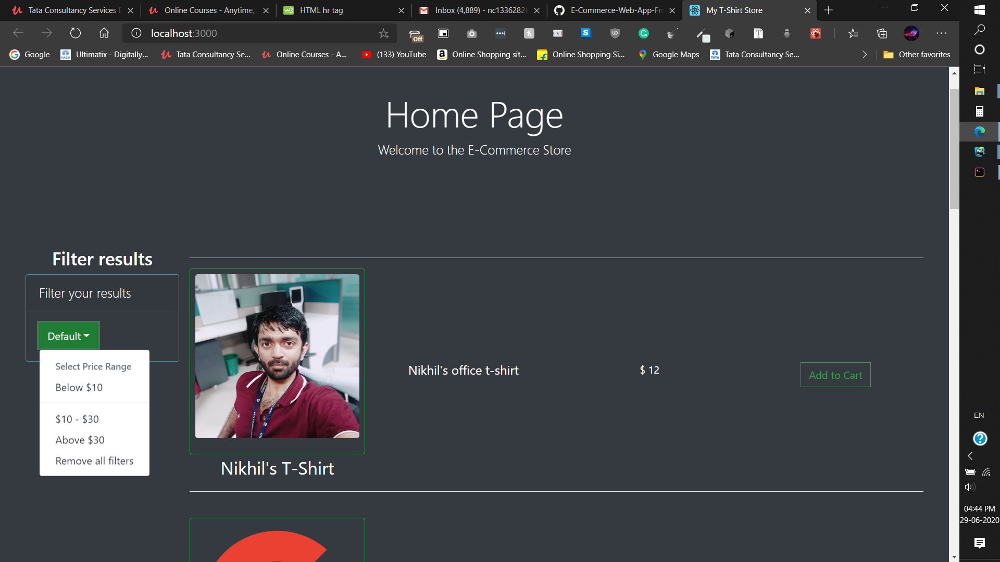

# Shoppersonic (Frontend)
#### This is an E-Commerce based web app which is kind of an Amazon clone. You will have to clone the "Shoppersonic (Backend)" as well to run this.

## Usage instructions
#### You'll need to have MongoDB installed on your system. Run the backend first https://github.com/Shoppersonic-Backend (Usage instructions available in the repo itself)
### Run the following commands (Once E-Commerce-Web-App-Backend is up and running):-
#### npm install
#### npm start

